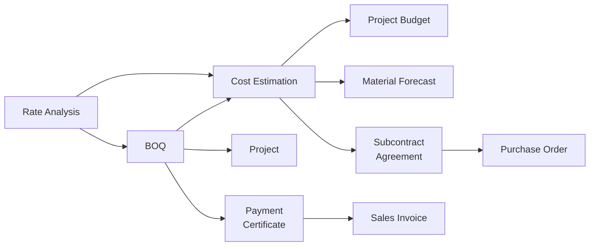
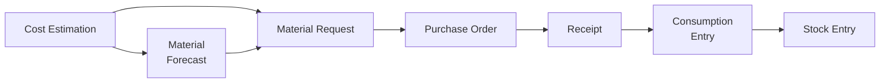
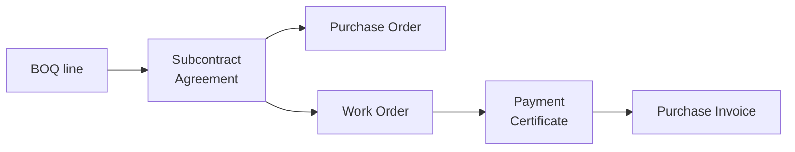

# Construction Management Suite — User Guide

*As of 2026-09-24. Published copy: https://claude.ai/artifact/X316c1N75nHD6eJF2z5r9z*

## What this adds to ERPNext

ERPNext already knows how to run a company: customers, suppliers, stock, invoices, payments, a ledger. What it does not know is that a building is **sold by measured quantity, built in stages, paid for in arrears, and held back against**. This suite adds that layer.

It replaces nothing. Every document you raise here produces the ordinary ERPNext document underneath, correctly linked. You certify a payment here and ERPNext gets the Sales Invoice; you agree a subcontract here and ERPNext gets the Purchase Order.



Two documents, two jobs. The **BOQ is the sales side** — the client's quantities
at the client's rates — and it is what you certify and bill against. The **Cost
Estimation is the cost side**, and it is what the job is planned, bought and
checked against: every material figure in this app comes from it, not from the
bill. A project can run on an estimate alone, with no BOQ at all.

The rule to hold on to: **this app measures and certifies, ERPNext accounts.** If a number has to reach the ledger it gets there through a document ERPNext already understands.

### What belongs where

| This app owns | ERPNext keeps owning |
| --- | --- |
| BOQ, Variation Order, BOQ Template | Project, Task, Timesheet |
| Rate Analysis, Cost Estimation | Item, Customer, Supplier, Price List |
| Project Budget, Cost Code | Sales Invoice, Payment Entry |
| Daily Site Report, Site Material Request | Material Request, Purchase Order, Purchase Invoice |
| Interim Payment Certificate, Retention Release | Stock Entry, warehouses, valuation |
| Subcontract Agreement, Work Order, Payment Certificate | The ledger, tax templates, cost centres |
| Material Forecast, Site Transfer, Consumption Entry | Accounting and stock reports |

### Who does what

Seven roles are installed on setup. Give people the one that matches the job.

| Role | For |
| --- | --- |
| Construction Admin | Everything, including the settings |
| Construction Project Manager | The whole project, approvals |
| Construction Quantity Surveyor | Bills, rates, estimates, certificates |
| Construction Billing Officer | Certificates and releases |
| Construction Site Engineer | Site reports, material requests, consumption |
| Construction Subcontractor | Their own agreements and certificates |
| Construction Viewer | Read only |

## Before you start

One screen decides how the whole module behaves: **Construction Settings** (search it from the awesome bar). Set it once per site, before the first bill is priced. Everything on it is optional, but a blank setting means the module falls back to a hard default, not to nothing.

### The settings that matter on day one

| Setting | What it does | Ships as |
| --- | --- | --- |
| Default Rate Source | How new BOQ lines get priced: Rate Analysis, Price List or Manual | Rate Analysis |
| Default Selling Price List | Used when the rate source is Price List | blank |
| Default Contingency % | Pre-filled on a new Cost Estimation | 5 |
| Default Retention % | Pre-filled on a new Payment Certificate | 5 |
| Default Subcontract Retention % | Pre-filled on a new Subcontract Agreement | 10 |
| Advance Recovery Threshold % | How far through the job an unrecovered advance starts complaining | 75 |
| Purchase Rate Tolerance % | How far above the estimate a purchase may go quietly | 10 |
| Consumption Tolerance % | How far above the take-off the site may consume quietly | 10 |
| Rate Analysis Is Company-Specific | An item's rate is looked up inside the company being priced for. Turn it off to share one rate library across companies | on |

### Billing items and taxes

The certificates raise a **single-line** invoice, and that line needs an Item. Three service items are created automatically on install:

| Setting | Item created | Used by |
| --- | --- | --- |
| Progress Billing Item | `SRV-PROGRESS-BILLING` | Interim Payment Certificate |
| Retention Release Item | `SRV-RETENTION-RELEASE` | Retention Release |
| Subcontract Billing Item | `SRV-SUBCONTRACT` | Subcontractor Payment Certificate |

Point them at your own service items if you already have them — the setup never overwrites a choice you have made.

**Tax is not set here.** A certificate, a release and an agreement take the **default tax template of their own company** — ERPNext's `Is Default` tick on the template itself — exactly as a Sales Invoice does. Tick one Sales and one Purchase template as default per company and every document opens with the rows already on it. A company with none simply asks you to pick, and a template belonging to another company is refused: its accounts are that company's, and the invoice behind the certificate would post to the wrong books.

**Material Consumption Account** is the expense account site issues are charged to. Left blank, the company's default expense account is used.

### Cost centres, and the site store

There is no setting, and nothing is created. Postings take the **project's own cost centre** if it has one, otherwise the **company default**. If you want a project's costs ring-fenced, give that Project a cost centre in ERPNext before you start billing.

A job has a store the same way it has a cost centre. Set **Default Warehouse** on the Project — it sits next to Cost Center and offers that company's warehouses only — and every material document fills a blank warehouse from it: consumption, site request, forecast, transfer, site diary, and the ERPNext order, request, receipt and stock-moving invoice. Only a blank: a warehouse somebody chose is never touched. A job running **several** stores names none, and then every entry has to say which, which is the honest answer.

### The last thing before real work

Check the three blocker sections — *Estimating*, *Purchasing and Budget*, *Progress Billing* — and decide what each one should do. They are covered in full further down, under **What the system will stop you doing**.

## The rate library

A **Rate Analysis** answers one question: what does one unit of this work actually cost us? One cubic metre of RCC is so many bags of cement, so many hours of labour, so much mixer time, plus overhead. Build the analysis once and every bill you price afterwards inherits it.

### Work is a service item, material is a stock item

Both come out of ERPNext's own Item master, and the difference between them is one checkbox:

- A **line of work** — *RCC M30*, *200mm blockwork* — is an Item with **Maintain Stock off**. It is what the job builds and what a Rate Analysis prices.
- A **material** — cement, aggregate, cable — is an Item with **Maintain Stock on**. It is what a store issues.

Every Item picker in the module offers only the right one of the two, and the server refuses a material row naming a service item. Get this the wrong way round and the take-off cannot see the line: it looks priced and orders nothing.

### Building one

1. Name the work and the **Item** it prices, with its UOM and output quantity (usually 1).
2. Add resource rows. Each row has a **type** — Material, Labour, Equipment, Subcontract or Overhead — a quantity and a rate. Waste is not a separate field: it belongs in the quantity, put there by whoever measured it.
3. The five type totals and the **rate per unit** compute as you type.

**Every material row must name a real Item.** A row with only a description is skipped by the take-off entirely, so the analysis looks priced and orders nothing — the app refuses to approve one. It is also what lets *Resource Take-off* and *Material Position* say how many bags of cement the whole job needs.

An analysis belongs to a **company**, and by default an item's rate is looked up inside the company being priced for. Two builders on one site keep their own labour and plant rates that way. A single-company site, or one keeping a deliberately shared library, turns *Rate Analysis Is Company-Specific* off.

### Active, default, approved

Three flags, and they do different jobs:

- **Is Active** — uncheck to retire it. Inactive analyses stay out of the pickers.
- **Is Default** — the one that gets picked automatically when a BOQ line names this item and several analyses exist. Turning off Is Active clears Is Default with it.
- **Status: Approved** — the gate for pricing. A bill priced from a Draft analysis is flagged on save; whether that warns or blocks is your setting.

A Rate Analysis is never submitted — it stays an editable master, like a BOM.

### Locking, and changing a locked one

Once an analysis is **Approved and referenced by a submitted BOQ or Cost Estimation**, its content locks: the resource rows, the output quantity, the item, the company, the currency and the rate basis all become read-only. The status stays editable so you can still mark an old one Obsolete.

To change it, use **Actions → New Version**. You get a Draft copy with the revision number stepped up and a link back to what it supersedes. The old one keeps working — two live versions is a normal state while a tender is in flight — and the **Newer Version** button on the old form takes you to the new one.

> Signed bills never move. Each priced BOQ line keeps a frozen snapshot of the build-up it was quoted on, so re-pricing the library cannot rewrite a bill the client has already seen. Where the library has since drifted, the BOQ's **Rate Drift** button shows you by how much.

### Update Cost

With a **Rate Basis** other than Manual — Valuation Rate, Last Purchase Rate or Price List — **Actions → Update Cost** re-prices the resource rows from that source.

- It refuses to run on an **Approved** analysis. Take a New Version first.
- Rows with no linked Item are left exactly as they are; hand-priced labour and overhead are meant to stay hand-priced.
- A row whose lookup finds nothing is skipped and named in the message. It never writes a zero over a good rate.
- Nothing cascades. Your BOQs and estimates do not move.

## The bill of quantities

The **BOQ** is the priced contract: what you are selling, in what quantities, at what rate. Everything downstream measures against it.

**A project is not required.** A bill is often priced for a client before there is a project to attach it to. Price it first; when the job is won, use **Create → Project** on the BOQ and the project is created and linked.

### The two rates on every line

This is the part worth reading twice.

| Column | Meaning |
| --- | --- |
| **Rate** | What you sell the unit for. This is the contract rate and the only one the client sees. |
| **Cost Rate** | What it costs you — the sum of the five component rates below. |
| Material / Labour / Equipment / Subcontract / Overhead Rate | The cost build-up, filled from the Rate Analysis |
| **Margin %** | Read-only: `(Rate − Cost Rate) ÷ Cost Rate × 100` |
| **Margin Amount** | Read-only: `(Rate − Cost Rate) × Qty` |

Margin is **never typed and never added on**. You set the selling rate; the margin is whatever falls out of it against cost, recalculated live as you edit either side. That is why the Grand Total is simply the sum of the lines — there is no separate profit line inflating it.

### Pricing the lines

The **Rate Source** on the bill decides where rates come from:

- **Rate Analysis** — the line's analysis fills the cost build-up and proposes the rate
- **Price List** — the selling rate comes off the chosen price list
- **Manual** — you type everything

**Actions → Price Lines** re-prices the bill from the library in one pass. It leaves lines that already carry a rate alone unless you tick *overwrite*.

### Work Breakdown

Below the lines on both the BOQ and the Cost Estimation, **Work Breakdown** shows the document at all three of its levels at once: the section, the work under it, and what that work is priced to consume, with totals at each level. Click a line to open its resources, or *Expand all*.

It reads the **frozen build-up** saved on each line — what the line was actually priced at, not what the library says today — and labels any line where no build-up was kept, so a rate that has drifted is visible rather than assumed. On a bill it shows the selling side and the cost side together; on an estimate everything is cost.

### Item numbers

Every line gets an **Item No** that is assigned once and never revised. Insert a row in the middle and it takes the next free number in its section rather than pushing everything down — so an item quoted to the client as 2.4 is still 2.4 next month. Numbering is flat (1, 2, 3) until the bill has sections, and becomes 1.1 / 2.3 once it does.

### Templates and revisions

- **Import from Template** brings in a standard bill you have saved as a *BOQ Template*.
- **Create Revision** on a submitted BOQ produces the next revision, linked to the one it replaces.
- **View → Rate Build-up** shows, per line, the build-up it was priced on beside the library's figures today.

### What submitting does

On submit the bill is checked and locked. Two checks can stop you, both configurable: **a line priced from an unapproved Rate Analysis**, and **a bill below your minimum margin**. A line priced below cost is flagged while you work, not at submit.

After submission, certified quantities flow back onto the bill from the payment certificates, so the BOQ always shows how much of each line has been built and billed.

## Costing the job

A **Cost Estimation** is the internal counterpart of the bill: not what the client pays, but what the job will cost you to deliver. Raise it from the BOQ (**Create → Cost Estimation**) so the lines come across already linked — or raise it straight off the project, which is the normal thing on a job nobody is billed for.

**A project has exactly one.** The take-off adds up every submitted estimate on a project, so a second one would double every material quantity on the job. To change an estimate, cancel it and amend it: ERPNext's own revision flow keeps the original on file and the amendment supersedes it. The app refuses a second submitted estimate outright.

Each line carries the five cost components per unit; the document adds them up, applies **contingency** as a percentage on top, and compares the result to the selling price so you can see the margin before you commit.

**Contingency** is the allowance for what you cannot foresee — ground conditions, weather, rework. It defaults to your site setting (5%) and sits on the total, not on any one line.

### Approving it seeds the budget

Submitting a Cost Estimation creates a **Project Budget** from its lines, and an amendment brings the budget with it — a draft budget is rewritten from the estimate that owns it, keeping any cost code you set against a line that survived. A budget somebody has already **submitted** is not rewritten behind your back: the estimate says so and leaves it to you. Amend the budget and use **Refresh from Estimate** to bring it onto the new plan.

From then on the budget is the thing you watch:

- **Refresh Actuals** pulls real spend from the ledger — expense-account entries tagged to the project — and outstanding Purchase Orders as committed cost
- Rows that name a **Cost Code** get the actuals broken down onto them. Where several rows lead back to one account the ledger cannot tell them apart, so the spend is apportioned between them in proportion to what each was budgeted, and the document says it did
- **Variance** is budget less actual, per row and for the project
- The **Project Cost Variance** report is the same picture as a tree: open a heading to see the codes beneath it, and the heading shows what they come to

**Cost Codes nest.** Tick *Is Group* on a code to make it a heading — 01 Substructure — and give the codes beneath it 01 as their parent. A heading carries no budget of its own; it totals what is under it, and a budget line against one is refused, because the same money would be counted twice. Open **Cost Code** from the workspace to see the whole breakdown as a tree.

Give each code a **Debit Account**. That account's ledger entries for the project are what a budget row's *actual* is read from, so a code with no account reads as nothing spent however much the job spent — the variance report says so at the top when it happens.

A submitted budget is also what the purchasing blocker measures against: raise a Purchase Order that takes the project past its budget and the system says so.

## Variations

Work that is not in the bill is a **Variation Order**, not a bigger certificate. This is the one rule the system enforces hardest, because certifying beyond the contract quantity bills the client for work no contract covers.

A variation holds both directions. Lines with a positive amount are **additions**, lines with a negative amount are **omissions**, and the document shows the net. **Get Items from BOQ** pulls the original lines so a variation can be linked to the row it varies, keeping the audit trail intact.

Each variation is numbered in sequence per project and shows what it does to the contract sum:

| Field | Meaning |
| --- | --- |
| Original Contract Value | The contract before any variation, from the linked BOQ |
| Previous Variations | Net of every other approved variation on this project |
| Net Variation Amount | Additions less omissions on this document |
| Revised Contract Value | What the contract becomes if this one is approved |

Submitting moves the **Project's contract value** by the net amount; cancelling moves it back. A time extension in days can be recorded alongside.

Because the project's contract value moves, later payment certificates measure progress against the revised sum, not the original bill.

## Materials

The chain runs from the priced bill to the issue slip, and every step nets against the one before it so nothing is ordered or used twice.



A forecast is optional. **Get from the Take-off** on a draft Material Request or Site Material Request asks the estimate directly what is still to buy, so a job bought line by line as the work comes up never needs one.

Everything on this chain is tracked **per line of work**, not just per material. The same cement sits under the substructure, the blockwork mortar and the plaster, and **For Work** on every row says which of them it was bought and burnt for. It rides from the request to the order to the receipt to the stock movement on its own.

### Material Forecast

**Get Materials from the Estimate** explodes every priced line into the materials underneath it, via the rate analysis each line was priced on. Nobody retypes a take-off.

One row per material **per line of work**, not one row per material: the same cement under three trades cannot be split later by a document that never said which.

The figures it produces:

| Column | Meaning |
| --- | --- |
| For Work | The line of work this material is for |
| Net Qty Required | What the estimate's quantity explodes into for this material |
| Already Ordered | On open Purchase Orders for this project — read-only, from the system |
| Qty To Order | Net required less already ordered |
| Estimated Rate / Value | What it was costed at |

Waste is not a separate column. It belongs in the quantity, put there by whoever measured it — a rate analysis that needs 5% extra cement says so in its cement figure.

You can have **several forecasts on one project** — by phase, by package, by month. Each one nets against the others, so the second forecast offers only what the first did not already cover. Quantities remain editable: the take-off is a starting point, not a verdict.

For an item whose UOM must be a whole number, **Qty To Order rounds up**. Ordering 8,059 of the 8,059.8 a take-off asks for leaves the job short by design.

**Create → Material Request** raises the ERPNext request for what is still to order, tagged back to the forecast.

### Site Material Request

What the site asks for, as opposed to what the plan says. Submitting it raises an ERPNext **Material Request**; cancelling it cancels that request back.

### Site Transfer

Moving material between stores or sites. On submit it posts an ERPNext **Stock Entry** of type Material Transfer, linked both ways.

### Material Consumption Entry

What was actually used. **Get Planned Materials** brings in what the project is expected to consume and has not yet, so the storekeeper confirms rather than types.

On submit it posts a **Stock Entry** (Material Issue) charged to the project and the consumption expense account. Cancelling it cancels the stock entry.

Consuming more of a material than the bill was priced to need is checked against your **Consumption Tolerance %** and either ignored, warned or blocked.

### Material Position — the report that ties it together

The same cement appears in concrete, in mortar and in plaster. No single document could tell you how much cement the job needs in total. **Material Position** does, one row per material:

| Column | Reads |
| --- | --- |
| For BOQ Items | Which bill lines this material serves |
| Required | What the priced bills explode into, waste included |
| Forecast · Requested · Ordered · Received · Consumed | Each stage of the chain |
| Balance | Required less consumed — what the job still has to use |
| Est. Rate vs Actual Rate, Rate Var % | What it was costed at against what was paid |
| Est. Value, Consumed Value, Value Variance | The same in money |

Filter by project (required), BOQ, item group, or tick **Over-consumed only** to see just the materials running past the take-off. The summary bar shows take-off value, consumed value, the variance, and how many items are over.

## The site

### Daily Site Report

The site diary, and the evidence behind every claim you will later make. One report per project per day — a second one for the same date is refused, because two diaries for one day is how a day gets counted twice.

It records weather, working hours and delays, and four tables: **activities**, **labour**, **equipment** and **materials**.

- Labour cost is headcount × daily rate **plus** overtime hours × overtime rate. Overtime is worked and paid, so it belongs in the day's cost.
- Equipment cost counts **idle hours as well as worked hours**. Plant on hire costs money whether it turns or not.
- Safety incidents are recorded here and surface on the workspace.

Submitting a report updates the ERPNext Project's **percent complete** from the most recent report, so the project header reflects the site rather than a guess.

**Create → Material Consumption** raises a consumption entry for what the day's report says was used.

## Billing the client

An **Interim Payment Certificate** measures what has been built this period, deducts what the contract says to hold back, and raises the invoice.

### Raising one

Start from the BOQ (**Create → Interim Payment Certificate**), from the project, or from the previous certificate's **Next Certificate** button — which carries the project, bill, client, contract value and retention across.

**Get Items from BOQ** brings the contract lines in with what has already been claimed against each. Then you enter one number per line: **Qty This Period**.

Everything else is computed:

| Line figure | From |
| --- | --- |
| Previous Qty Claimed | Every submitted certificate on this project — recomputed on every save, never typed |
| Cumulative Qty | Previous + this period |
| Amount This Period | Qty this period × contract rate |
| Remaining Qty | Contract qty less cumulative |
| Percent Complete | Cumulative amount ÷ contract amount |

### Down the certificate

```
Net Payable = Gross − Retention − Advance Recovery − Other Deductions
```

- **Gross This Period** — the sum of the lines
- **Cumulative To Date** — previous certificates plus this one
- **Retention** — gross × retention %, and the running **total held** across the project
- **Advance Recovery** — what you are recovering this period against the client's advance
- **Taxes** — charged on the **net payable**, from the tax template, because that is what the invoice is raised for
- **Total Payable** — net payable plus tax

Deductions can never exceed what was certified. A negative net payable is a credit note, not a certificate, so the system stops it and tells you to carry the balance to the next one.

### What submitting does

One **Sales Invoice** is raised for the net payable, as a single line against your Progress Billing Item, described with the project and certificate number, with the tax template applied. The certified quantities are pushed back onto the BOQ.

### Retention Release

Money held back is released by its own document. It reads the project's position for you — everything held across submitted certificates, less everything already released — and suggests an amount from the **Release Type**: *Practical Completion* proposes half the outstanding retention, *Defects Liability* and *Full Final Release* propose all of it. The suggestion only fills a blank amount; type your own and it stays.

Submitting raises a Sales Invoice for the release against your Retention Release Item.

## Subcontractors

The mirror image of client billing: you let a package, instruct it in pieces, certify what was built, and pay. Three documents, in order.



### Subcontract Agreement

The package and its terms: scope, rates, retention, advance, performance bond, defects liability period.

**Get Items from BOQ** is the connection that makes the whole thing trackable. It pulls the bill lines for the trade at their **cost rate**, not their selling rate — the cost rate is what you priced the work to be built for, so it is the right yardstick for what you agree to pay. Paying a trade more than the bill allowed for is flagged against your setting.

Submitting raises an ERPNext **Purchase Order** for the agreed value.

### Subcontractor Work Order

An agreement is the package; a work order is the instruction to do a part of it. Use **Get Scope from Agreement** and it offers only what has not been instructed yet, netting against the other work orders already raised. Nothing can be instructed twice.

Progress is recorded on the work order itself, on a submitted document: enter **Completed Qty** per line and the completed value, completion percentage and status update in place. The status walks Draft → Issued → In Progress → Completed on its own.

### Subcontractor Payment Certificate

What you certify and pay. Raise it from the agreement or from the work order — from the work order it brings the schedule across with it.

**Get Completed Work** claims what the work orders record as built and not yet certified, so the certificate follows what was actually instructed and done rather than a typed claim.

The arithmetic mirrors the client side: gross claimed, less previously certified, less retention (your subcontract retention default, typically higher than the client's), less advance recovery, less other deductions, plus tax on the net.

Submitting raises a **Purchase Invoice** and pushes the running totals — claimed, certified, paid, balance due — back onto the agreement.

### Two things worth watching

**Back-to-back terms.** Retention you hold from a trade should be no less than the retention the client holds from you, and released no earlier. The defaults are set that way (10% subcontract against 5% client) but the system does not enforce the relationship — check it when you write the agreement.

**Advances.** An advance paid to a trade that is never recovered is money gone. Once the job passes your recovery threshold with an advance still outstanding, the certificate says so.

## What the system will stop you doing

Ten checks guard the places where construction money goes wrong. Each one is a setting in **Construction Settings** with three positions:

- **Ignore** — silent
- **Warn** — a message you can proceed past
- **Stop** — refused

| Check | Fires when | Ships as |
| --- | --- | --- |
| Line Priced From An Unapproved Analysis | Submitting a BOQ priced off a Draft rate analysis | Warn |
| Line Priced Below Cost | A line's selling rate is under its cost rate | Warn |
| Bill Below Minimum Margin | The whole bill's margin falls under your floor | Ignore |
| Purchase Order Over Project Budget | A PO takes the project past its submitted budget | Warn |
| Subcontracting Above The Costed Rate | An agreement pays a trade more than the bill allowed | Warn |
| Buying Above The Estimated Rate | A purchase exceeds the estimate by more than the tolerance | Warn |
| Advance Left Unrecovered | The job passes the recovery threshold with an advance outstanding | Warn |
| Certifying More Than The Contract Qty | A certificate would bill beyond the contract quantity | **Stop** |
| Consuming More Than The Take-off | Site issues exceed the take-off by more than the tolerance | Warn |
| Work Item Is A Stock Item | A line of work is priced against something a store issues | Warn |
| Material Resource Not A Stock Item | A material row names a service item, so it can never be issued | Stop |
| Work Item Has No Approved Analysis | Nothing can cost the line, so it plans no material at all | Warn |
| Project Has No Cost Estimation | There is no plan to buy or check against | Stop |
| Unit Cannot Be Converted | A row's unit has no conversion to the unit the item is held in | Warn |

Three of them have a companion tolerance so small overruns stay quiet: **Purchase Rate Tolerance %** (10), **Consumption Tolerance %** (10) and **Advance Recovery Threshold %** (75).

### Why over-certification ships as Stop

Every other check is a judgement call. This one is not: certifying beyond the contract quantity bills the client for work no contract covers and leaves the bill showing more built than sold. The right answer is always a **Variation Order**, and the message says so, with the exact quantity that would fit. Quantities a hair over the contract figure are treated as re-measurement rounding, not a claim.

You can set it to Warn. Think hard before you do.

### Other things that are simply refused

These are not configurable, because there is no sensible way to allow them:

- Deductions greater than the amount certified — a negative certificate
- A negative quantity on a certificate line — to reverse, cancel the certificate that made it
- Two Daily Site Reports for the same project on the same day
- Releasing more retention than the project holds
- Editing a locked Rate Analysis instead of taking a new version
- Instructing work that another work order already covers

## Where to look

### The workspace

**Construction Management Suite** in the sidebar opens on the contract position — eight live figures across every project:

Contract Value · Approved Variations · Billed to Date · Retention Held · Actual Cost · Subcontracted · Certificates Awaiting · Safety Incidents

Below that, shortcuts to the documents you open daily, then every document grouped by module, plus the ERPNext documents that belong to the same job — Material Request, Purchase Order, Sales Invoice, Stock Entry — so you do not have to leave the page.

### The project page

Open any Project and the construction position sits above the form: contract, billed and the percentage of it, retention held, budget, actual, percent complete. The **Create** menu raises any construction document for that project with its details filled in, and the **Connections** tab lists everything raised against it.

### Reports

| Report | Answers |
| --- | --- |
| **BOQ Summary** | The bill by section and category, with certified progress |
| **Resource Take-off** | What a priced document explodes into — every resource under every line, scaled by quantity, grouped how you like. Reads the Cost Estimation by default, the BOQ on request |
| **Material Position** | Per material: needed, forecast, requested, ordered, received, consumed, left, estimated rate against actual |
| **Project Cost Variance** | Budget against actual and committed, by cost code |

### Printed documents

Five print formats are installed and ready to send: **BOQ**, **Variation Order**, **Interim Payment Certificate**, **Subcontract Agreement** and **Subcontractor Payment Certificate**. The BOQ format shows the client the selling side only — your cost build-up is never printed.

## Cancelling and amending

### Cancelling runs one way

Cancel a certificate and the invoice it raised is cancelled with it. Cancel the **invoice** and the certificate stays as it is — deliberately. The construction document is the parent; the ERPNext document is what it produced. Pulling on the child never unwinds the parent.

The same holds throughout: Subcontract Agreement → Purchase Order, Payment Certificate → Purchase Invoice, Consumption Entry → Stock Entry, Site Material Request → Material Request.

When a cancellation is refused because something still depends on the document, that is the protection working. Cancel the dependant first.

### What a cancellation puts back

| Cancelling | Undoes |
| --- | --- |
| Interim Payment Certificate | The Sales Invoice, and the certified quantities on the BOQ |
| Variation Order | The movement in the project's contract value |
| Subcontractor Payment Certificate | The Purchase Invoice, and the agreement's running totals |
| Material Consumption Entry / Site Transfer | The Stock Entry |
| Site Material Request | The Material Request |

### Amending

Every document in the suite can be amended. Cancel it, open it, **Amend**, correct it, submit. The amendment keeps a link to what it amends, so the chain stays readable.

Retention held, cumulative amounts and previously-claimed quantities are all recomputed from the submitted documents on every save — so cancelling an early certificate correctly moves the figures on the ones after it.

## Common questions

**Do I have to create the project first?** No. Price the BOQ without one; use **Create → Project** when the job is won.

**Why can I not type a margin?** Because a margin you type is a number you have to defend twice. You set the selling rate; margin is what falls out of it against cost, live, on every line and on the bill.

**My rate analysis changed. Did my signed bills move?** No. Each priced line keeps a frozen snapshot of the build-up it was quoted on. Use **Rate Drift** on the BOQ to see how far the library has moved since.

**Why will it not let me certify this quantity?** The cumulative quantity would exceed the contract quantity for that line. That is a variation, not a certificate — the message tells you exactly how much would fit.

**A work order says there is nothing left to instruct, but there is.** Check the other work orders on the same agreement. The scope offered is what the agreement contains less everything already instructed anywhere.

**Why is my invoice one line when my certificate has twenty?** By design. The client is being invoiced one amount — the net payable for the period — and the certificate is the breakdown behind it. The certificate is what you send with the invoice.

**Where do taxes come from?** The template in Construction Settings loads onto a new certificate automatically. Tax is charged on the **net payable**, so the certificate and the invoice always agree.

**Can two forecasts cover one project?** Yes, as many as you like. Each nets against the others, so nothing is ordered twice.

**How do I see how much cement this job still needs?** **Material Position**, filtered to the project. The Balance column is required less consumed.

**Something changed and I cannot see it.** Hard-refresh the browser (`Ctrl+Shift+R`). Frappe caches the desk aggressively and a stale page is the usual explanation.
